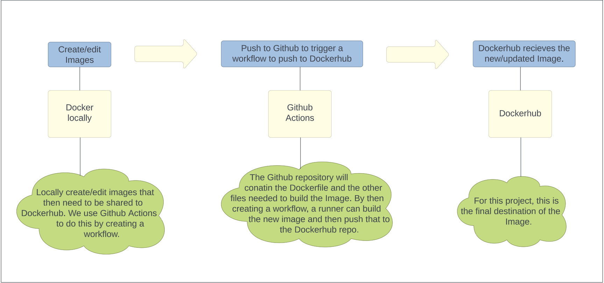

# 3120-cicd-Oluoma-Eziolise
## CI Project Overview
This project uses docker to create an image that hosts a website when ran as a container.  
What does this process look like?  

## Dockerize it
### How to install docker + dependencies
- Follow the `Install using the apt Repository` instructions in [How to install docker engine for ubuntu](https://docs.docker.com/engine/install/ubuntu/) exactly.
- If docker commands do not run after doing all the steps, try starting docker as a service.
- This process should install all dependencies needed for docker to work.
### How to build an image from the Dockerfile
- To build a Dockerfile use:  
```
docker build -t imageName:version .
```
- Note: The "." refers to the current working directory and the "-t" tells Docker to allocate a virtual terminal session within the container.
### How to Run the Container Locally
- To run container use:
```
docker run -t -p port:80 imageName:version
```
- Note: The -p flag specifies the port that you can access the container's content from. The container should serve content out of port 80 then it can be bound to an open port of the system the container is running on.
### How to View the Project Running in the Container
- To view the site, any IP associated with the host followed by the port used in the docker run command can be used. For example, localhost:port.
## Github Actions and Dockerhub
How to create a public repo on Dockerhub:  
- The first step is to create an account and sign in if you haven't already.
- Navigate to the repositories button, click it and then click create new repository.
- Give the repo a name and a description.
- Specify whether the repo will be public or private and then click create.  

Create a Dockerhub Personal Access Token:
This will be used when signing in on the CLI.
- While in the Dockerhub website, go to account settings and click on security.
- Under Access Tokens, click create new access token.
- Provide a short description and then set the permissions for the token, i.e. what can someone who has this token do with the repository?
- Make sure to copy the generated token.  

How to sign in on the ubuntu CLI:  
- Start the service docker on a CLI.
- Then type the following:- (Username is the one used when creating the Dockerhub account.)
```
docker login -u username
```  
- Once prompted for a password, enter the token previously created.  

Pushing Images without Github Actions:
- To push an image, it would need a new tag.
- Tag the image using this command format:- 
```
docker tag ImageName:tag dockerhubUserName/repository-name:tag
```
- Then run:-
```
docker push dockerhubUserName/repository-name:tag
```  

Configuring Github Secrets:
How to add Dockerhub username and password/access token as Github Secrets.
- Navigate to the repository you want to add the secret to and go into the settings for that repository (Note: not Github account settings).
- Navigate to the `security` section and then the `secrets and variables` section within it.
- Click `New repository secret`.
- Add the Dockerhub username and access token as separate secrets.  

Behaviour of Github Workflow:
The workflow builds and pushes a new image to Dockerhub.
- The workflow will be triggerd when a push to the main branch occurs.
- It will excute the buildAndPush job on the ubuntu-latest runner.
- It will also set up the environment to build and push the new Docker image using the Github Secrets created.
- Once the image is built, it will be pushed to Dockerhub with the tag `username/repoName:tag`.

## CD Project Overview
This part of the project uses workflows to introduce version control to the images uploaded to Dockerhub. It also webhooks to automatically roll out image updates to servers hosting the site content.

## Semantic Versioning
One way to incorporate semantic versioning is by using Git Tags.
Here is how to generate a tag in git / GitHub:
- Once youve made a change to the image that you want to push to Dockerhub, create a git tag using this command:
```
git tag -a v*.*.* -m "message"
```  
What happens after this depends on how the workflow is set up. Here is the behavior of GitHub workflow once triggered:
- First of all, To trigger the wokrflow, a tag that contains at least a major, minor, and patch must be created and pushed to Github.
- Once pushed, the workflow will build and push the a new image to Dockerhub. 
- Dockerhub will receive the image with 4 tags; one with the major verison, one with the major and minor version, one with the major, minor, and patch, and finally one with a latest tag.  

Need proof?  
Here is a link to my Dockerhub repository: [My DokcerHub](https://hub.docker.com/r/oeziolise/starter-website/tags)

## Deployment

### Installing Docker on an AWS Ubuntu instance
To Install docker on the instance follow the same directions as stated in [How to install Docker + Dependencies](#how-to-install-docker--dependencies).  

### Container Restart Script
Using a script to restart the container once a new image is available aids in the automation process each time a container needs to be restarted based on an updated image. [Restart.sh](/deployment/restart.sh) uses the generic name `site` for all conatainers. When ran, restart.sh will stop and remove any running conatiners called site. It will then pull the latest image from my repository, oeziolise/starter-website. Finally, it will run a new container based off of the latest image that was just pulled. To use this script, it should be located in the ubuntu user's home directory or bin folder.

### Setting up a Webhook on the Instance
To install [adnanh's `webhook`](https://github.com/adnanh/webhook) use the following command:
```
sudo apt-get install webhook
```  
To get webhook to start, the path `/etc/webhook.conf` needs to exist. For the webhook to actually do something, create a hook in the /etc/webhook.conf file. Once the specified path exists and the hook is created, webhook should start up once the system boots as well as start listening for messages if the hook is configured properly.

### Webhook Task Definition File
The Webhook task definition file is a JSON file called [hooks.json](/deployment/hooks.json). The hook for this project is called `my-chicken`, and it runs the restart.sh script and sets the working directory to be /var/webhook (NOTE: /var/webhook likely will not automaticlly exist on the system and you might have to create it yourself). To replicate this, place the contents of [hooks.json](/deployment/hooks.json) in the file `/etc/webhook.conf`.

### Configuring DockerHub to message the listener
For Dockerhub to send messages to the listener, it needs a webhook on its end. Here is how to create one:
- Select the repository to create the webhook for.
- Select the Webhooks tab.
- under `New Webhook`, enter the Webhook's name and the url the listener is listening on.
- Click create.  
Now, every time a new image is pushed to the specified repository on Dockerhub, it will send a message to the listener that will then trigger the hook to pull and restart the container.   
Need proof?  
Here is a link to a vidoe of my site getting updated automatically in real time:  
VIDEO LINK: [My video](https://youtu.be/5xNVM8I8PSo)! (NOTE: The text that changes it at the bottom left of the site).
